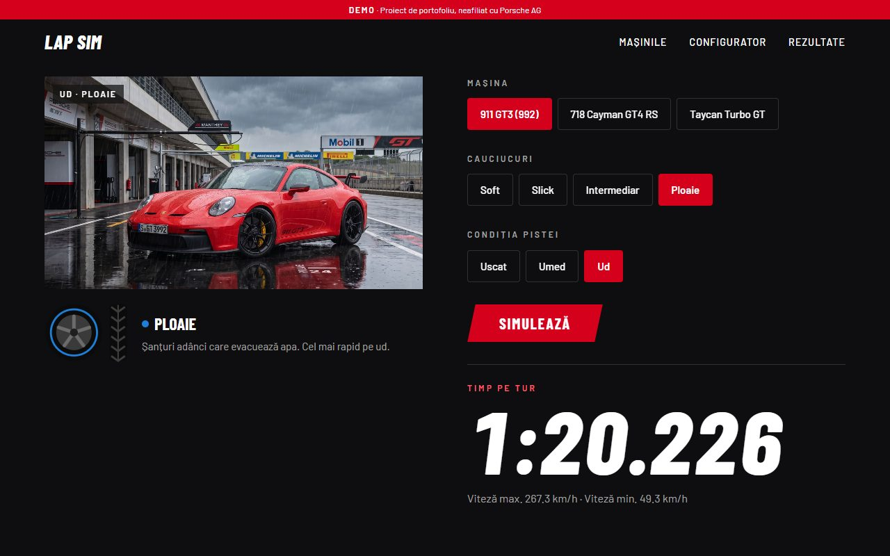
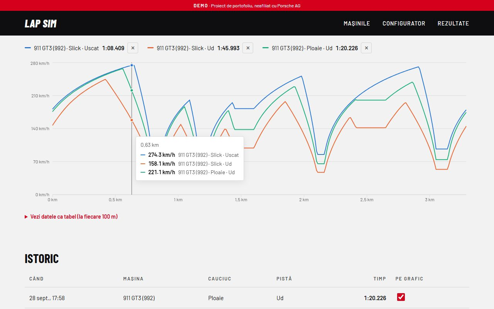
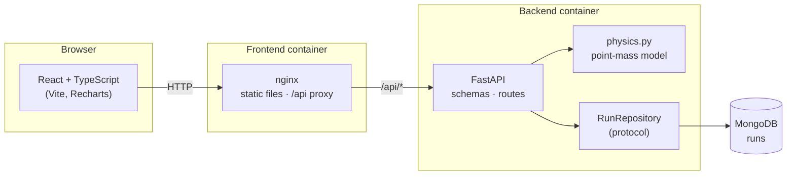

# Lap Sim

[](https://github.com/TiberiuSzabo/lap-sim/actions/workflows/ci.yml)

A lap-time simulator for three sports cars on one test track. Pick a car, a tire compound and the
track condition; a Python physics model computes the lap, the result is stored in MongoDB, and the
React front end plots the speed along the lap so you can compare up to three runs.

> Portfolio project. Not affiliated with Porsche AG. Car figures are approximate public specs,
> aerodynamic values are estimates, and the car images are AI-generated.





## What it shows

- **Physics you can check by hand.** A point-mass model: corner speed from grip and downforce,
  acceleration limited by power, grip and drag, braking with grip plus drag. On the wet track the
  right tire is almost 26 s a lap faster than slicks.
- **A layered backend.** FastAPI endpoints, Pydantic schemas separate from the domain dataclasses,
  and a repository pattern with a MongoDB and an in-memory implementation.
- **Tests at every layer**, run on every push by GitHub Actions: physics, HTTP API, repository
  contract tests against a real MongoDB, and front-end logic.
- **An accessible, responsive front end.** Semantic HTML, WCAG AA contrast, keyboard navigation,
  a data table behind the chart, and every animation respects `prefers-reduced-motion`.

## Architecture



- The physics module is pure Python with no FastAPI or Mongo imports, so it is tested on its own
  and also runs from the command line (`python -m app`).
- Routes depend on the `RunRepository` protocol, not on MongoDB. The API tests swap in the
  in-memory repository through FastAPI's `dependency_overrides`, so they need no database.
- Configuration comes from environment variables: `MONGO_URL` (in-memory storage when unset) and
  `CORS_ORIGINS`.

## How the simulation works

1. The track is a list of straights and constant-radius corners, sampled every metre.
2. Each point gets a speed limit: top speed on straights, the grip limit in corners
   (`m·v²/r = μ·(m·g + ½·ρ·ClA·v²)`).
3. **Forward pass:** from each point, how fast can the car be at the next one by accelerating?
4. **Backward pass:** how fast can it be here and still brake in time for the next point?
5. Lap time is the sum of distance over average speed. Both passes run twice around the loop so the
   start line knows the speed carried from the end of the lap (a flying lap).

The friction coefficient comes from a tire × condition table, tuned so each tire wins in "its"
condition, which the tests check.

## Run it

With Docker only (no Python or Node needed):

```bash
docker compose up --build          # site on http://localhost:3000, API docs on http://localhost:8000/docs
```

For development with hot reload, run the front end with Vite instead (Node.js 20+):

```bash
cd frontend
npm install
npm run dev                        # http://localhost:5173, talks to the API on port 8000
```

Without Docker, the backend also runs on its own, with runs kept in memory:

```bash
cd backend
python -m venv .venv
.venv\Scripts\activate             # macOS/Linux: source .venv/bin/activate
pip install -r requirements-dev.txt
uvicorn app.main:app --reload
```

## Tests

```bash
cd backend
pytest                             # 49 tests; the MongoDB ones are skipped unless MONGO_URL is set

cd frontend
npm test                           # Vitest
```

CI (`.github/workflows/ci.yml`) runs three jobs on every push: backend tests with a MongoDB
service container, front-end lint + tests + build, and a build of both Docker images.

## API

| Method | Path | Description |
| --- | --- | --- |
| `GET` | `/api/cars` | Cars (aero estimates are not exposed) |
| `GET` | `/api/tracks` | Tracks with their length |
| `POST` | `/api/simulate` | `{car_id, track_id, tire, condition}` → saved run with telemetry (`201`) |
| `GET` | `/api/runs` | Latest 20 runs, without telemetry |
| `GET` | `/api/runs/{id}` | One run with telemetry |

Unknown ids return `404`; an invalid tire or condition returns `422`.

## Project structure

```
backend/
  app/physics.py        lap simulation (pure, no web or database code)
  app/models.py         domain dataclasses: Car, Track, Tire, Condition
  app/data.py           cars, grip table, test track
  app/schemas.py        API shapes (Pydantic)
  app/repository.py     RunRepository protocol, MongoDB and in-memory implementations
  app/main.py           FastAPI routes, CORS, dependency injection
  tests/                physics, API and repository tests
frontend/src/
  api.ts                typed API client
  sections/             page sections (hero, cars, configurator, results)
  components/           reusable pieces (chart, history table, pills, reveal)
  comparison.ts         which runs are on the chart and their colours
frontend/Dockerfile     multi-stage: Node builds the site, nginx serves it
frontend/nginx.conf     static files + /api proxy to the backend
docker-compose.yml      MongoDB + backend + frontend
.github/workflows/      CI
```

## Limitations and next steps

- A point-mass model ignores weight transfer and combined grip (braking while turning). Those,
  plus a battery model for the Taycan, would be the next physics steps.
- Car data is approximate and the model is not validated against real lap times.
- The track is a list of segments, not real geometry.
- Not deployed. The backend image and environment-based config are ready for a container host
  (e.g. Azure Container Apps) with MongoDB Atlas, and the front end for a static host.
